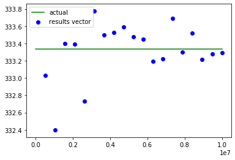
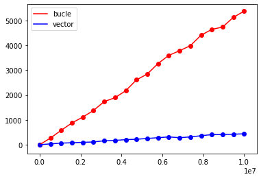

# Vectorizacion del Metodo Monte Carlo para el calculo de integrales
En el notebook se ve una comparativa de tiempos entre los dos metodos usados para el calculo de la integral. Ademas de una grafica de la funcion con los puntos generados.

Para la ejecucion de el metodo monte carlo se generan numeros de manera aleatoria para con metodos probabilisticos aproximar expresiones matematicas complejas (en este caso una integral). 
A mas numeros generados mas proxima sera la estimacion al valor real.

Para por ejemplo realizar el calculo de la integral se hara uso de esta formula.

$I ≈  \frac{N_{debajo}}{N_{total}}(b-a)M$

Al hacer millones de calculos el programa se ralentiza si lo hacemos de una manera iterativa. Por eso es que se usan vectores para realizar los calculos de manera mas rapida operando en los mismos datos con una sola instruccion.

